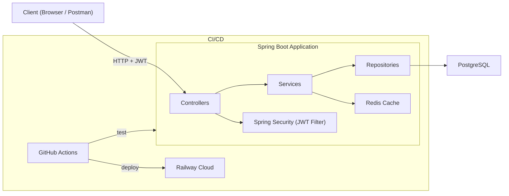

# JobPulse 🚀

<div align="center">
  
  
  
  
  
  
</div>

## 📌 Overview
JobPulse is a modern, RESTful API built with **Spring Boot 4** and **Java 21**, designed to help job seekers track their applications, interviews, and follow-ups. It features secure JWT authentication, advanced caching, and automated background tasks.

**Live Demo:** `https://jobpulse-production-bd49.up.railway.app/`

## 🏗 Architecture
JobPulse follows a clean, layered monolithic architecture:
* **Presentation Layer:** REST Controllers with strict DTO validation.
* **Business Layer:** Services handling application logic and `@Scheduled` background tasks.
* **Data Access Layer:** Spring Data JPA with PostgreSQL.
* **Caching Layer:** Redis cache for high-performance dashboard statistics.
* **Security:** Spring Security 7 with stateless JWT authentication.



## ✨ Key Features
* **Stateless Authentication:** Secure JWT-based login and registration.
* **Job Tracking Lifecycle:** Full CRUD operations for Applications, Companies, and Interviews.
* **High-Performance Dashboard:** Aggregated statistics cached in **Redis** to reduce database load.
* **Background Workers:** `@Scheduled` cron jobs to manage automated interview reminders.
* **Observability:** Spring Boot Actuator enabled for health checks and cloud load balancer integration.
* **CI/CD Pipeline:** Fully automated testing and building using GitHub Actions.

## 📡 API Endpoints

| Method | Endpoint | Description |
|---|---|---|
| `POST` | `/api/v1/auth/register` | Create a new account |
| `POST` | `/api/v1/auth/login` | Login (returns JWT) |
| `GET` | `/api/v1/auth/me` | Get current user profile |
| `GET` | `/api/v1/applications` | List applications (paginated, filterable) |
| `POST` | `/api/v1/applications` | Create new application |
| `PUT` | `/api/v1/applications/{id}` | Update application |
| `PATCH` | `/api/v1/applications/{id}/status` | Update application status |
| `DELETE` | `/api/v1/applications/{id}` | Delete application |
| `GET` | `/api/v1/companies` | List companies (paginated) |
| `PUT` | `/api/v1/companies/{id}` | Update company |
| `GET` | `/api/v1/contacts` | List contacts |
| `POST` | `/api/v1/contacts` | Create contact |
| `PUT` | `/api/v1/contacts/{id}` | Update contact |
| `POST` | `/api/v1/interviews` | Schedule interview |
| `PUT` | `/api/v1/interviews/{id}` | Update interview |
| `POST` | `/api/v1/reminders` | Create reminder |
| `GET` | `/api/v1/tags` | List tags |
| `POST` | `/api/v1/tags` | Create tag |
| `GET` | `/api/v1/dashboard/stats` | Dashboard statistics (cached) |
| `GET` | `/actuator/health` | Health check |

## 🧪 Testing Strategy
JobPulse is built with reliability in mind, utilizing the **Test Pyramid**:
* **Unit Tests:** Business logic testing using `JUnit 5` and `Mockito` (22 tests across 5 service test files).
* **Integration Tests:** Full database integration testing utilizing **Testcontainers** (6 tests spinning up isolated Dockerized PostgreSQL databases for `MockMvc` endpoints).

## 🚀 Local Setup (Docker)

To run this project locally, all you need is Docker!

1. Clone the repository:
   ```bash
   git clone https://github.com/psh0x00/jobpulse.git
   cd jobpulse
   ```
2. Start the database and cache using Docker Compose:
   ```bash
   docker compose up -d
   ```
3. Run the Spring Boot application:
   ```bash
   ./mvnw spring-boot:run
   ```

## 🌐 Cloud Deployment
This application is containerized using a **Multi-Stage Dockerfile** and deployed via Continuous Deployment (CD) to cloud infrastructure. 
The production environment relies on a managed PostgreSQL instance and an external Redis cluster.
